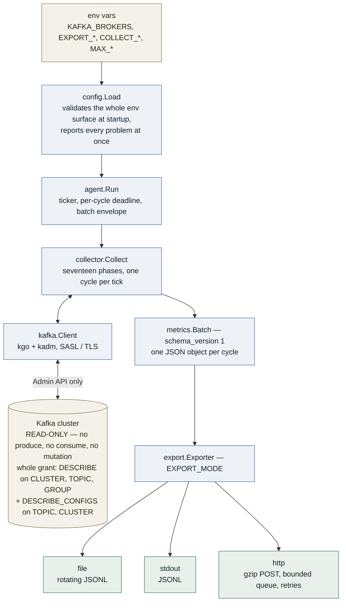
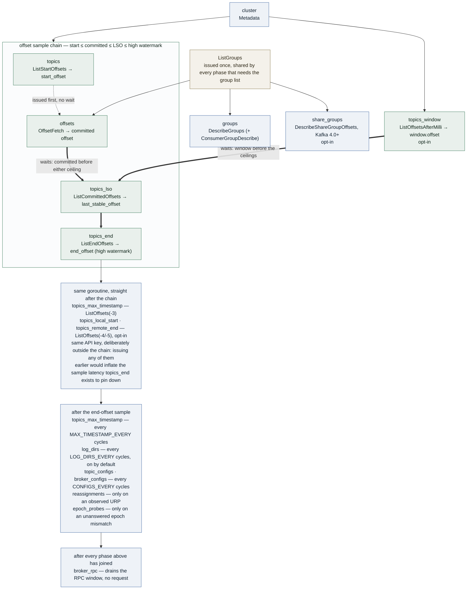

# streamsight-agent

A read-only Kafka metrics collector. Every cycle it issues a handful of Admin API
requests, turns the answers into one JSON object (a *batch*), and ships that batch
to a local file, an HTTP endpoint, or stdout.

It performs **no writes**: no produce, no consume, no topic or config mutation. The
entire permission requirement is `DESCRIBE` on `CLUSTER`, `TOPIC` and `GROUP`, plus
`DESCRIBE_CONFIGS` on `TOPIC` and `CLUSTER`. All five are read-only; `DESCRIBE_CONFIGS`
reads configuration and is not `ALTER_CONFIGS`.

## How it works



### Collection order is a correctness constraint

One cycle runs seventeen phases. The five that sample the offset chain are the part worth
reading closely: the order in which they are sampled decides the *sign* of the error you get
from the unavoidable skew between the calls. The rest either wait for that chain to finish,
sample on their own cadence, fire only on a trigger, or issue no request at all, and are
drawn grouped:



Five phases wait for the end-offset sample, and they wait for two different reasons. Three
are **cadenced**: `log_dirs` every `LOG_DIRS_EVERY` cycles, `topic_configs` and
`broker_configs` every `CONFIGS_EVERY`, reporting `skipped` on the cycles in between. The
other two are **triggered, not cadenced**: they read this batch's own `topics[]` and
`offsets[]` and issue nothing at all unless the cluster gives them a reason —
`reassignments` needs an under-replicated partition, `epoch_probes` a committed leader epoch
that disagrees with the partition's current one *and* has not already been asked about. In a
healthy cluster both report `skipped` forever.

`broker_rpc` never issues a request at all: it drains an accumulator filled elsewhere — the
client's own RPC hooks — which is why it runs last, after `wg.Wait()`, so the RPC window
covers this cycle's own traffic.

Sampling in that order makes every quantity derived from a pair of samples err slightly
high rather than going negative — a caught-up consumer must never report `-3`, and a hung
transaction must never report a negative backlog and read as healthy:

| Derived quantity | Formula | Requires |
|---|---|---|
| consumer overrun | `committed < start_offset` | start sampled before committed |
| `read_uncommitted` lag | `end_offset − committed` | committed before end |
| `read_committed` lag | `last_stable_offset − committed` | committed before LSO |
| open-transaction backlog | `end_offset − last_stable_offset` | LSO before end |

Only this order keeps all four non-negative at once. `topics_window`
(`COLLECT_THROUGHPUT_WINDOW`) joins the same chain: its offset is the lower edge of a
record count whose upper edge is the high watermark, so it is issued *before* the end
offsets or that count comes out negative. `log_dirs`, `topic_configs`, `broker_configs`,
`reassignments` and `epoch_probes` are the phases whose position does not affect
correctness; all five still wait, so an O(replicas) response, an O(topics) one, or a
triggered fan-out never shares the wire with the rate-bearing high-watermark call.

The *wire* order of `sections[]` is different and also fixed: `cluster`, `topics`,
`topics_window`, `topics_lso`, `topics_end`, `topics_max_timestamp`, `topics_local_start`,
`topics_remote_end`, `groups`, `offsets`, `epoch_probes`, `log_dirs`, `reassignments`,
`topic_configs`, `broker_configs`, `share_groups`, `broker_rpc`. See
[docs/ARCHITECTURE.md](docs/ARCHITECTURE.md) for the package map, the per-cycle sequence
and the request budget.

## Quick start (no endpoint, no API key)

The default export mode is a local JSONL file — one JSON object per line, one line per
cycle, logs on stderr. Nothing else is required:

```bash
make build
KAFKA_BROKERS=localhost:9092 ./bin/kafka-metrics-agent

tail -f metrics.jsonl | jq '{seq: .batch_seq, topics: (.topics|length), sections: [.sections[]|{name,status}]}'
```

Pipe batches straight to another process instead:

```bash
KAFKA_BROKERS=localhost:9092 EXPORT_MODE=stdout ./bin/kafka-metrics-agent | jq .
```

Ship them to a collector — a two-variable change:

```bash
KAFKA_BROKERS=localhost:9092 \
EXPORT_ENDPOINT=https://ingest.example.com/v1/batches \
API_KEY=... \
./bin/kafka-metrics-agent
```

No Kafka to hand? `docker compose up -d` starts a single-node broker plus the agent in file
mode, and publishes the broker on `localhost:9092` so the commands above work against it
(`docker compose exec agent tail -f /var/lib/streamsight/metrics.jsonl`).

## Export modes

`EXPORT_MODE` is `file`, `http` or `stdout`. If it is unset, the agent picks `http`
when `EXPORT_ENDPOINT` is set and `file` otherwise — so adding an endpoint is the
only step needed to go from local to remote.

| Mode | Destination | Needs a credential | Delivery |
|------|-------------|--------------------|----------|
| `file` (default) | `EXPORT_FILE`, one JSON object per line | no | synchronous, buffer flushed every batch |
| `stdout` | stdout, same framing | no | synchronous, one `write` per batch |
| `http` | `POST EXPORT_ENDPOINT` | `API_KEY` | bounded queue + single worker, retried |

### File mode

* One batch per line, newline-terminated. `json.Marshal` escapes embedded newlines, so a
  line is always exactly one record — `tail -f | jq -c .` never sees a partial object.
* The parent directory is created if missing; the file is opened `O_APPEND` mode `0644`
  and reopened on restart, so a restart appends rather than truncates.
* The buffer is flushed after every batch, which survives the process dying — but a flush
  reaches the page cache, not the platter, so power loss can lose more unless
  `EXPORT_FILE_FSYNC=true`.
* Rotation is by size and happens *before* the write, so a batch is never split across two
  files. At `EXPORT_FILE_MAX_MB` the agent renames `metrics.jsonl` → `metrics.jsonl.1`,
  shifting `.1` → `.2` … and deleting `.<EXPORT_FILE_MAX_BACKUPS>`.
* A rotation that shifts the backups but then cannot reopen the live file — a full or
  read-only volume — retries only the reopen on the next batch. Replaying the shift would
  destroy every backup generation within `EXPORT_FILE_MAX_BACKUPS` cycles, having written
  nothing.
* Write, flush and rotation failures are returned, logged, counted in
  `agent.batches_dropped` and surfaced in the next batch's `agent.last_export_error`.

The file is plain JSONL with no wrapper, so any log shipper that reads lines and parses
JSON works unchanged; rotation is rename-based, so point the shipper at the path and let it
follow the new inode. Keep its retention above
`EXPORT_FILE_MAX_MB × (EXPORT_FILE_MAX_BACKUPS + 1)` or a slow shipper will miss records
rotation has already deleted. Under Docker or Kubernetes, `stdout` mode is simpler — the
runtime already collects it, and agent logs go to stderr precisely so stdout stays
parseable.

### HTTP mode

* One batch per `POST`, body is the same single JSON object, `Content-Type:
  application/json`.
* Headers: `X-API-Key`, and `Idempotency-Key: <agent_instance_id>-<batch_seq>` so a
  delivered-but-unacknowledged batch can be deduplicated by the receiver.
* `EXPORT_GZIP` (default on) compresses the body and sets `Content-Encoding: gzip`.
* Retries: `408`, `429` and every `5xx` are retried up to `EXPORT_MAX_RETRIES` with
  full-jitter backoff (uniform in `[0, EXPORT_BASE_DELAY << (n-1)]`, capped at 30s). A
  `Retry-After` header overrides that delay, clamped to 5 minutes. Every other `4xx` is
  terminal and counted as `batches_rejected` — a rejected batch is a configuration or
  schema problem, not a transient one.
* The queue is bounded by `EXPORT_QUEUE_SIZE` and the enqueue never blocks: collection must
  not stall behind a slow ingest. Batches are **encoded on the way in**, so the queue holds
  gzipped bodies rather than live object graphs — roughly a tenth of the memory, and a retried
  batch is marshalled once rather than once per attempt. An overflow evicts the **oldest**
  queued batch and counts it in `agent.batches_dropped`: this is a monitoring agent, so when
  the ingest cannot keep up the thing worth keeping is the freshest view of the cluster, not
  the stalest. Either policy leaves a `batch_seq` gap; this one leaves it in the past.
* One batch may occupy the single export worker for at most **one minute** in total, across
  every attempt and every wait between them. Without that ceiling three retries each honouring
  a clamped `Retry-After: 300` would hold the worker for fifteen minutes while the queue behind
  it turned over completely and the agent shipped nothing.
* On `SIGTERM` the agent stops accepting batches, drains the queue, and cancels an
  in-flight request after a grace period of `2 × EXPORT_TIMEOUT`. A batch that is
  mid-backoff when shutdown starts is abandoned and counted as dropped.

## Configuration

Everything is environment variables, validated at startup. The agent reports *all*
configuration problems at once and exits non-zero — one restart per fix, not five.

### Required

| Variable | Notes |
|----------|-------|
| `KAFKA_BROKERS` | Comma-separated `host:port`. Blank entries are dropped; a value with no usable entry is an error. |

### Export

| Variable | Default | Required when | Notes |
|----------|---------|---------------|-------|
| `EXPORT_MODE` | `http` if `EXPORT_ENDPOINT` is set, else `file` | — | `file` \| `http` \| `stdout`. Any other value is an error. |
| `EXPORT_ENDPOINT` | `https://ingestion.streamsight.cloud/v1/batches` | http mode | Full URL that batches are POSTed to, **verbatim** — the agent appends no path, so the route is the receiver's decision. The default is applied only once http mode is chosen: assigned earlier it would flip an unconfigured agent out of file mode and into posting at production, because `EXPORT_MODE` is inferred as `http` iff an endpoint is set. |
| `API_KEY` | — | `EXPORT_MODE=http` | Sent as `X-API-Key`. Never required in file/stdout mode. |
| `EXPORT_FILE` | `./metrics.jsonl` (`/var/lib/streamsight/metrics.jsonl` in the image) | file mode | Parent directories are created. |
| `EXPORT_FILE_MAX_MB` | `100` | file mode | `0` uses the 100MB default; negative disables rotation. |
| `EXPORT_FILE_MAX_BACKUPS` | `3` | file mode | `0` keeps none. Negative is an error. |
| `EXPORT_FILE_FSYNC` | `false` | file mode | `fsync` after every batch. Off by default: a flush already survives the process dying, and only power loss needs a device round trip. Collection is synchronous, so on a network volume a stalled `fsync` stalls collection. |
| `EXPORT_QUEUE_SIZE` | `20` | http mode | Must be > 0. Queue of encoded bodies; overflow evicts the oldest. |
| `EXPORT_MAX_RETRIES` | `3` | http mode | Must be >= 0. `0` is honoured as "never retry", not treated as unset. |
| `EXPORT_BASE_DELAY` | `1s` | http mode | Must be > 0. Backoff base. |
| `EXPORT_TIMEOUT` | `10s` | http mode | Must be > 0. Per-request deadline. |
| `EXPORT_GZIP` | `true` | http mode | |

### Collection

| Variable | Default | Notes |
|----------|---------|-------|
| `COLLECTION_INTERVAL` | `5s` | Must parse and be > 0. The first cycle runs immediately, not after one interval. |
| `COLLECTION_TIMEOUT` | 80% of `COLLECTION_INTERVAL` (`4s`) | Per-cycle deadline. Exceeding the interval is a startup warning, not an error. Note the interaction with metadata caching: kgo may serve cached metadata for up to half the interval (2.5s at the defaults), so a cycle that runs past that refetches part-way through instead of resolving every offset listing against one snapshot. |
| `INCLUDE_INTERNAL_TOPICS` | `false` | Includes topics the broker flags internal (`__consumer_offsets`, `__transaction_state`) — the broker's own flag, not a name-prefix guess. |
| `TOPIC_INCLUDE_REGEX` | `""` (all) | Compiled at startup; a bad pattern fails the process. |
| `TOPIC_EXCLUDE_REGEX` | `""` | Exclude wins over include. |
| `GROUP_INCLUDE_REGEX` | `""` | |
| `GROUP_EXCLUDE_REGEX` | `""` | |
| `GROUP_STATES` | `""` (all) | Comma-separated states the broker should list: `Unknown`, `PreparingRebalance`, `CompletingRebalance`, `Stable`, `Dead`, `Empty`. Case-insensitive; an unrecognised state fails startup. Filtered **broker-side**, so it shortens both `groups[]` and `offsets[]` and reports no truncation. **Requires Kafka 2.6+** (ListGroups v4, KIP-518): an older broker drops the filter on the wire and returns every group with no error, so startup probes `ApiVersions` on every broker and refuses to run if any is older. |
| `COLLECT_LAST_STABLE_OFFSET` | `true` | Adds `partitions[].last_stable_offset` via `ListCommittedOffsets`, sampled between the committed offsets and the high watermarks. Leave it on: without it every `read_committed` consumer on a transactional topic reports permanent false lag. No new ACL; one extra `ListOffsets` fan-out per cycle. |
| `COLLECT_CONSUMER_GROUPS` | `true` | Adds the KIP-848 fields — `groups[].group_epoch`, `assignment_epoch`, `assignor`, per-member `member_epoch` / `target_assignment` — via `ConsumerGroupDescribe`. It is the only way to see a new-protocol group at all: the classic describe returns one with empty join metadata and **no error**. Needs Kafka 4.0+; startup probes `ApiVersions` and disables it with a log line on an older cluster, so the cost there is one round trip, not a rejected request per cycle. No new ACL. |
| `COLLECT_LOG_DIRS` | `true` | Adds the `log_dirs[]` section (per-broker, per-directory replica bytes and offline-disk detection) via `DescribeLogDirs`. On by default because it is the only source of per-replica disk bytes, and every storage question the product answers rests on it: days-to-full, per-topic chargeback, follower lag in bytes without JMX, JBOD imbalance, and the average record size that converts every record rate into a byte rate. No ACL beyond the `DESCRIBE` on `CLUSTER` already required, but the response is O(replicas) = partitions × replication factor, the largest payload the agent emits — which is what `LOG_DIRS_EVERY` is for. Size `MAX_TOPICS`/`MAX_PARTITIONS_PER_TOPIC` before running it at `LOG_DIRS_EVERY=1` on a large cluster. |
| `LOG_DIRS_EVERY` | `24` | Run the log-dirs phase every Nth cycle — two minutes at the default interval, because disks fill over hours. Must be >= 1 (`1` = every cycle); `0` is an error, not "every cycle". Ignored when `COLLECT_LOG_DIRS=false`. |
| `COLLECT_THROUGHPUT_WINDOW` | `false` | Adds `throughput_window` and `partitions[].window` via `ListOffsetsAfterMilli`: the produce rate measured **by the broker**, and the only rate input in the batch that survives an agent restart or a missed cycle. Off by default because it adds a `ListOffsets` fan-out — two on a mostly-silent cluster — to every cycle it runs on. Needs ListOffsets v1 (Kafka 0.10.1+); startup disables it below that, where the broker answers with no timestamp at all and no error. No new ACL. |
| `THROUGHPUT_WINDOW` | `5m` | How far back the window reaches. It earns its cost only when it is **wider than `COLLECTION_INTERVAL`**: inside one interval a backend can already difference two batches. Must be > 0. |
| `THROUGHPUT_WINDOW_EVERY` | `1` | Run the window phase every Nth cycle. Must be >= 1. |
| `COLLECT_MAX_TIMESTAMP` | `true` | Adds `partitions[].max_timestamp` — the newest record's timestamp and the offset carrying it — via `ListOffsets` at timestamp `-3` (KIP-734). **No new ACL**: same API key as the four offset phases, and the broker authorizes before it reads the timestamp field. It replaces an inference with a measurement: topic liveness is otherwise guessed from a run of zero end-offset deltas, which cannot tell a silent topic from a missed cycle. One extra `ListOffsets` fan-out; measured 4 ms on a 3-broker cluster. Needs Kafka 3.0+ (ListOffsets v7); below that the broker reads `-3` as a real millisecond and answers with an arbitrary offset **and no error**, which is why startup disables it rather than trusting the value. A partition with no max timestamp answers `-1` and ships `null`. |
| `COLLECT_TIERED_OFFSETS` | `false` | Adds `partitions[].tiered.local_start_offset` via `ListOffsets` at `-4` (KIP-405): the earliest offset actually on the broker's **disk**, as opposed to `start_offset`, which on a tiered cluster is the global earliest including remote storage. A consumer reading between the two still succeeds and fetches from object storage at object-storage latency — a state nothing else in the batch distinguishes from healthy. Off by default because on a cluster without remote storage it returns the same answer as `start_offset` for the price of a round trip. Needs Kafka 3.4+ (ListOffsets v8). No new ACL. |
| `COLLECT_LATEST_TIERED` | `true` | Additionally asks for `tiered.remote_end_offset` at `-5` (KIP-1005) — how far the archival tier is behind. **Ignored unless `COLLECT_TIERED_OFFSETS` is also set.** Gated apart from the local start because KIP-1005 landed five releases after KIP-405, so a 3.4–3.8 cluster serves one and not the other; one null inside a present `tiered` object is a real state, not an error. Needs Kafka 3.9+ (ListOffsets v9). No new ACL. |
| `COLLECT_SHARE_GROUPS` | `false` | Adds the `share_groups[]` section via `ShareGroupDescribe` + `DescribeShareGroupOffsets` (KIP-932). Share groups are **not** consumer groups under another name: members share partitions and acknowledge individual records, so there is no committed offset per partition, no assignment to diff, and no lag in the committed-versus-end sense. They ship in their own section so no consumer-group derivation runs silently against a shape it does not model. Needs Kafka 4.0+. **Never exercised against a broker that can answer.** |
| `COLLECT_CONFIGS` | `true` | Adds `topic_configs[]` and `broker_configs[]` via `DescribeConfigs`, over a fixed allowlist (10 topic keys, 11 broker keys). **The only collector that needs an ACL outside the three DESCRIBE grants** — `DESCRIBE_CONFIGS` on `TOPIC` and on `CLUSTER` — and it defaults **on** anyway, because what it collects is a correction rather than a feature. Without the grant these two sections report `unauthorized` and nothing else degrades; set `COLLECT_CONFIGS=false` to stop asking. `cleanup.policy` marks the compacted topics, where offset deltas are not record counts and consumer lag is overstated by an unknowable amount — without it the product reports a confident wrong number. `min.insync.replicas` separates "redundancy is reduced" from "every `acks=all` produce is failing right now", which the URP gauge alone cannot do. `offsets.retention.minutes` turns consumer overrun from a post-mortem into a prediction. Measured cost: **+517 B gzipped on the cycles it runs**, 8 B/batch amortised at the default cadence. Needs Kafka 1.1+ (DescribeConfigs v1, the version that carries `ConfigSource`); startup disables it below that rather than shipping every key as an indistinguishable default. |
| `MAX_TIMESTAMP_EVERY` | `12` | Run the max-timestamp phase every Nth cycle — once a minute at the default interval. Must be >= 1. Cadenced for two independent reasons. **Broker cost**: `-3` is the only offset sentinel that is not O(1). `-1` and `-2` read `logEndOffset`/`logStartOffset`, numbers already in memory; `-3` makes the broker walk every local log segment comparing cached `maxTimestampSoFar`, then on Kafka 3.8+ do an index lookup and scan the winning batch. **Payload**: `partitions[].max_timestamp` is the largest single field the agent adds — measured 77.7 B/partition raw and **18.9% of the gzipped batch**, and gzip cannot fold it because each value is a distinct wide integer. The question it answers — "when was the last record written" — has a minutes-scale answer, so a 60s-stale figure costs nothing real. |
| `CONFIGS_EVERY` | `360` | Run the config phases every Nth cycle. The slowest cadence in the agent: configs change when a human changes them. Must be >= 1. |
| `COLLECT_REASSIGNMENTS` | `true` | Adds `reassignments[]` via `ListPartitionReassignments` — "is this URP a failure or a planned move", the largest false-positive source in URP alerting. **The request is issued only when an under-replicated partition is observed**, so in a healthy cluster it costs one pass over a slice and the section reports `skipped`. Needs Kafka 2.4+. No new ACL. |
| `COLLECT_EPOCH_PROBES` | `true` | Adds `epoch_probes[]` via `OffsetForLeaderEpoch`: positive proof of truncation (`committed_offset > end_offset` at the committed epoch), as opposed to the "high watermark went backwards" heuristic. **Fires only when a group's committed leader epoch disagrees with the partition's current one**, so it issues nothing in steady state. Needs Kafka 0.11+. No new ACL. |
| `COLLECT_RPC_STATS` | `true` | Adds `agent.rpc` — per-broker latency histograms, bytes, connect failures and quota throttling, measured by hooks on the requests the agent already sends. Zero extra requests, zero ACL. Counters are per-window deltas reset every cycle: divide by `window_ms`, never by `COLLECTION_INTERVAL`. |

Regexes are **unanchored**: `orders` also matches `prod.orders`. Write `^orders$` for
an exact match. Group IDs beginning with `__` are always skipped.

**Removed after v0.2.0:** `COLLECT_GROUP_STATES`, `GROUP_STATE_POLL_INTERVAL` and
`MAX_TRANSITIONS_PER_GROUP`. The fast group-state poll was measured against a real rebalance
storm and detected 2 of 31 rebalances, because a rebalance completes well inside its
shortest useful tick; member-set churn in `groups[].members[].member_id` detected all 31 at
zero request cost. Unset variables are ignored, not rejected. `GROUP_STATES` above is a
**different** setting — the broker-side `ListGroups` filter — and is unaffected.

`GROUP_STATES` is the cheapest cardinality control available: the broker applies it before
building the response, so filtered groups never cross the wire. The flip side — both logged
as startup warnings — is that excluding `Empty` hides groups whose consumers have *all*
died, which is usually the incident you are looking for, and that a group leaving the
filtered set is indistinguishable at the backend from a deleted one.

### Cardinality caps

Hard ceilings on what one batch may contain. Every **entity** cap defaults to `0` =
unlimited, because a non-zero default would be an untested guess that silently shortens the
customer's own inventory on first deploy. Use `TOPIC_INCLUDE_REGEX`/`GROUP_INCLUDE_REGEX`
for *intentional* selection; use these when you have measured the cluster and need a
ceiling. Setting any of them logs a startup warning.

| Variable | Default | Notes |
|----------|---------|-------|
| `MAX_ERRORS` | `1000` | Maximum entries in `errors[]` per batch; `0` = unlimited (and logs a warning). Behind deduplication this is a backstop that essentially never fires. When the cap bites, entries are admitted in priority order — whole-request and authorization failures survive ahead of the per-partition flood. |
| `MAX_ERROR_SAMPLES` | `1` | Verbatim occurrences emitted per distinct failure mode before the rest are folded into the exemplar's `count`. Must be >= 1. |
| `MAX_TOPICS` | `0` (unlimited) | Maximum topics per batch. Also shrinks the request fan-out: it caps the topic list sent to `ListStartOffsets`/`ListCommittedOffsets`/`ListEndOffsets` and the topic+partition set sent to `DescribeLogDirs`. |
| `MAX_PARTITIONS_PER_TOPIC` | `0` (unlimited) | Maximum partitions emitted per topic. Payload cap only for the offset listings — kadm's `List*Offsets` take topic names, so the broker computes every partition regardless — but it does shrink the `DescribeLogDirs` request, whose partitions are named on the wire. |
| `MAX_GROUPS` | `0` (unlimited) | Maximum consumer groups per batch. Enforced once, on the shared `ListGroups` result, so it shrinks the `DescribeGroups` and `OffsetFetch` fan-out **and truncates the `offsets` section as well as `groups`**. |
| `MAX_MEMBERS_PER_GROUP` | `0` (unlimited) | Maximum members emitted per group. `groups[].generation` is derived from the members that were emitted, so a truncated group can under-report it. |
| `MAX_OFFSETS_PER_GROUP` | `0` (unlimited) | Maximum committed offsets emitted per group. |

No cap adds an ACL requirement, and none adds a request. `MAX_TOPICS` and `MAX_GROUPS`
strictly *reduce* what is asked for; the rest only trim the payload.

### Kafka authentication

| Variable | Default | Notes |
|----------|---------|-------|
| `KAFKA_SASL_MECHANISM` | `""` | `PLAIN`, `SCRAM-SHA-256`, `SCRAM-SHA-512`. Anything else is an error. |
| `KAFKA_SASL_USERNAME` | — | Required iff a mechanism is set. |
| `KAFKA_SASL_PASSWORD` | — | Required iff a mechanism is set. Redacted from all logs. |
| `KAFKA_TLS_ENABLED` | `false` | System root CAs, verified certificates, TLS 1.2 floor. There is no "skip verification" knob. |

### Agent

| Variable | Default | Notes |
|----------|---------|-------|
| `LOG_LEVEL` | `info` | `debug` \| `info` \| `warn` \| `error`. Logs go to **stderr**. |
| `AGENT_INSTANCE_ID` | `<hostname>-<8 hex>` | Travels on every batch. Set it explicitly to something stable (e.g. the pod name) if the backend keys on it; the default's random suffix changes on every restart. |

## What it collects

Per cycle, from the Admin API only:

* **Cluster** — cluster ID and broker list (id, host, port, rack). Absent entirely when the
  metadata request failed, rather than present with a zero broker count: `broker_count: 0` is
  a legal value, so shipping it would be a claim rather than an admission. No controller id:
  on KRaft the broker answers that with a *random* live broker, so it changes on roughly two
  of every three healthy batches and carries no information.
* **Topics** — partition count, replication factor, and per partition: leader, leader
  epoch, replicas, ISR, offline replicas, log start offset, last stable offset, high
  watermark.
* **Groups** — state, coordinator, protocol, members (client ID, host, static instance
  ID, subscribed topics, assignment, owned partitions).
* **Offsets** — committed offset per group / topic / partition.
* **Log directories** (on by default, `COLLECT_LOG_DIRS`, every `LOG_DIRS_EVERY` cycles) —
  per broker, per directory: each replica's on-disk size, its per-replica offset lag,
  in-flight JBOD moves, offline disks reported by the broker that owns them, and the
  underlying volume's total and usable bytes on Kafka 3.3+.
* **Max timestamp** (on by default, `COLLECT_MAX_TIMESTAMP`) — per partition, the newest
  record's timestamp and the offset carrying it: topic liveness measured rather than
  inferred from a run of zero end-offset deltas.
* **Tiered offsets** (opt-in, `COLLECT_TIERED_OFFSETS`) — the local log start, and
  optionally the remote end: on a tiered cluster, the difference between a consumer reading
  from disk and one falling off the latency cliff into object storage.
* **Topic and broker configs** (on by default, `COLLECT_CONFIGS`, every `CONFIGS_EVERY`
  cycles) — a fixed allowlist of 10 topic and 11 broker keys. `cleanup.policy` is what marks
  a compacted topic, where offset deltas are not record counts and lag is overstated.
* **Share groups** (opt-in, `COLLECT_SHARE_GROUPS`, Kafka 4.0+) — KIP-932 queue-semantics
  groups, in their own section because they have no committed offset per partition and no
  assignment, so no consumer-group derivation applies to them.
* **Throughput window** (opt-in, `COLLECT_THROUGHPUT_WINDOW`) — the first offset at or
  after a broker-chosen timestamp, per partition: a produce rate measured by the broker
  rather than differenced across batches.
* **Reassignments** (triggered) — which of the under-replicated partitions the controller
  reports as moving on purpose.
* **Epoch probes** (triggered) — proof that a truncation ate records a group had already
  consumed, rather than the heuristic that a high watermark moved backwards.
* **Principal** — the SASL username the agent authenticated as, so a batch can be attributed
  to a credential. A username, never a credential, and empty for anonymous or
  mTLS-authenticated connections.
* **Capabilities** — what the cluster can be asked, per broker: the API versions behind
  every gate above, so an absent signal is attributable to a broker version rather than to
  collection breaking.
* **Agent** — its own uptime, batch counters, queue depth, last export error, and its own
  per-broker RPC latency, bytes, connect failures and quota throttling.
* **Sections** — per-phase status, sample timestamp and duration.

Not obtainable this way, and therefore absent: broker CPU, broker-side request latency and
per-topic byte rates. Those need JMX. (`agent.rpc` is latency and bytes as *this agent*
saw them, which is a property of one client's connection to a broker, not of the broker.) See
[docs/ARCHITECTURE.md](docs/ARCHITECTURE.md) for the request budget per cycle.

## Output

One batch per cycle, from the local test environment with default settings — this is cycle 7
of 24, so `log_dirs` and the two config sections are `skipped` for being off-cadence rather
than disabled — abridged (long partition and member lists cut):

```json
{
  "schema_version": 1,
  "agent_version": "v0.2.0",
  "agent_instance_id": "agent-7c9f4d2b",
  "batch_seq": 7,
  "collected_at": "2026-08-16T12:22:40.090740553Z",
  "collection_ms": 12,
  "cluster": {
    "id": "MkU3OEVBNTcwNTJENDM2Qg",
    "broker_count": 1,
    "brokers": [{"id": 1, "host": "kafka", "port": 9092}]
  },
  "topics": [
    {
      "name": "orders",
      "id": "furP32/eSvyEmz61ycxI+A==",
      "internal": false,
      "partition_count": 3,
      "replication_factor": 1,
      "partitions": [
        {"id": 0, "leader": 1, "leader_epoch": 0, "replicas": [1], "isr": [1],
         "start_offset": 0, "last_stable_offset": 98, "end_offset": 98}
      ]
    }
  ],
  "groups": [
    {
      "id": "order-processor",
      "state": "Stable",
      "coordinator": 1,
      "generation": -1,
      "protocol": "range",
      "protocol_type": "consumer",
      "member_count": 1,
      "members": [
        {
          "member_id": "console-consumer-9443e6f3-0ced-443c-9ccc-460c3a9e5fb3",
          "client_id": "console-consumer",
          "host": "/172.20.0.2",
          "subscribed_topics": ["orders"],
          "assignment": [{"topic": "orders", "partition": 0}]
        }
      ]
    }
  ],
  "offsets": [
    {
      "group_id": "order-processor",
      "offsets": [
        {"topic": "orders", "partition": 0, "offset": 98, "leader_epoch": 0},
        {"topic": "orders", "partition": 1, "offset": 596, "leader_epoch": 0}
      ],
      "offset_count": 2
    }
  ],
  "agent": {
    "uptime_sec": 60, "batches_collected": 7, "batches_exported": 6,
    "batches_dropped": 0, "batches_rejected": 0, "export_retries": 0, "queue_depth": 0
  },
  "sections": [
    {"name": "cluster",              "status": "ok",      "sampled_at": "2026-08-16T12:22:40.090245298Z", "duration_ms": 4},
    {"name": "topics",               "status": "ok",      "sampled_at": "2026-08-16T12:22:40.095159048Z", "duration_ms": 7},
    {"name": "topics_window",        "status": "skipped", "sampled_at": "2026-08-16T12:22:40.095161002Z", "duration_ms": 0},
    {"name": "topics_lso",           "status": "ok",      "sampled_at": "2026-08-16T12:22:40.098912004Z", "duration_ms": 2},
    {"name": "topics_end",           "status": "ok",      "sampled_at": "2026-08-16T12:22:40.101431771Z", "duration_ms": 2},
    {"name": "topics_max_timestamp", "status": "ok",      "sampled_at": "2026-08-16T12:22:40.103660412Z", "duration_ms": 2},
    {"name": "topics_local_start",   "status": "skipped", "sampled_at": "2026-08-16T12:22:40.103662887Z", "duration_ms": 0},
    {"name": "topics_remote_end",    "status": "skipped", "sampled_at": "2026-08-16T12:22:40.103663901Z", "duration_ms": 0},
    {"name": "groups",               "status": "ok",      "sampled_at": "2026-08-16T12:22:40.090288923Z", "duration_ms": 6},
    {"name": "offsets",              "status": "ok",      "sampled_at": "2026-08-16T12:22:40.096296465Z", "duration_ms": 2},
    {"name": "epoch_probes",         "status": "skipped", "sampled_at": "2026-08-16T12:22:40.103665114Z", "duration_ms": 0},
    {"name": "log_dirs",             "status": "skipped", "sampled_at": "2026-08-16T12:22:40.103667110Z", "duration_ms": 0},
    {"name": "reassignments",        "status": "skipped", "sampled_at": "2026-08-16T12:22:40.103668991Z", "duration_ms": 0},
    {"name": "topic_configs",        "status": "skipped", "sampled_at": "2026-08-16T12:22:40.103670224Z", "duration_ms": 0},
    {"name": "broker_configs",       "status": "skipped", "sampled_at": "2026-08-16T12:22:40.103671488Z", "duration_ms": 0},
    {"name": "share_groups",         "status": "skipped", "sampled_at": "2026-08-16T12:22:40.103672610Z", "duration_ms": 0},
    {"name": "broker_rpc",           "status": "ok",      "sampled_at": "2026-08-16T12:22:40.104910447Z", "duration_ms": 0}
  ]
}
```

Cut from that example, and worth knowing before you size an ingest: `agent.rpc` — the
`broker_rpc` payload — is per broker per API key, each row carrying two 12-bucket latency
histograms, and it grows with `brokers × API keys` rather than with the cluster's data.
That makes it dominate only where there is little data to dominate: on the one-broker local
environment above it was the largest single block in the batch, taking a batch that measured
2.0 KB uncompressed before the phase existed to 8.9 KB with it on. At real partition counts
the ranking inverts — `log_dirs` and `topics` are both larger, because both are O(partitions)
and this is not: measured on a 3-broker cluster at 390 partitions, `broker_rpc` is 4% of
the batch, while `topics` is about half of it.

`schema_version` is bumped on any backwards-incompatible change to this shape. The
`sections[].status` enum is closed in v1, which is why truncation is a separate boolean
rather than a sixth status.

### Reading the data correctly

Six things change how a consumer of this JSON must be written. Ignoring them
produces confidently wrong dashboards.

**1. Offsets are nullable, and `null` never means zero.**
`start_offset`, `end_offset` and a group's `offset` are `*int64`. `null` means *the agent
did not learn this number in this cycle* — an unreachable leader, a partition missing from
the response, or (for a commit) a group that has never committed to that partition. An
empty partition serializes as `0`; an unknown one serializes as `null`. Coercing `null` to
`0` reports the entire retained backlog as lag for every newly created or reset consumer
group, and reports an offline partition as empty. Any arithmetic on a `null` must produce
"unknown", not a number.

**2. `end_offset` is the high watermark; `last_stable_offset` is the LSO.**
On a topic written by transactional producers the high watermark counts aborted records and
commit markers, so a `read_committed` consumer can never reach it and shows permanent
residual lag against it by construction. Use the right ceiling for the consumer — see the
formulas under [Collection order](#collection-order-is-a-correctness-constraint). A
transaction backlog that is positive and not shrinking over many cycles is a **hung
transaction**. `last_stable_offset` is `null` when `COLLECT_LAST_STABLE_OFFSET=false` or
the lookup failed — check the `topics_lso` section status to tell those apart. One case has
no data-side tell at all: `ListOffsets` carries an isolation level only from v2
(Kafka 0.11), and the client drops the field when it downgrades, so a pre-0.11 broker
silently answers with the high watermark.

**3. Lag is computed by the consumer of this data, from the right sample.**
The agent ships raw offsets and computes nothing, because lag is only meaningful if you
know both halves were sampled and when. Each link of the chain has its own section — divide
an end-offset delta by `topics_end.sampled_at`, an LSO delta by `topics_lso.sampled_at`,
never by `collected_at`.

**4. `sections` distinguishes "nothing there" from "we could not look".**
A section is a collection phase. **All seventeen ship on every cycle, always in this
order**: `cluster`, `topics`, `topics_window`, `topics_lso`, `topics_end`,
`topics_max_timestamp`, `topics_local_start`, `topics_remote_end`, `groups`, `offsets`,
`epoch_probes`, `log_dirs`, `reassignments`, `topic_configs`, `broker_configs`,
`share_groups`, `broker_rpc`. A phase that did not run reports `skipped` rather
than vanishing, so a missing section is a protocol error, not a disabled feature. Status is
one of:

| Status | Meaning |
|--------|---------|
| `ok` | The phase completed. An empty `topics`/`groups` list really means none exist. |
| `partial` | Some entities failed. The list is truthful but incomplete; see `errors`. |
| `failed` | The phase produced nothing usable. Absence carries no information. |
| `unauthorized` | Same as failed, with an actionable cause: a missing ACL. |
| `skipped` | The phase never ran — cluster metadata failed, the phase is disabled (`topics_lso` with `COLLECT_LAST_STABLE_OFFSET=false`) or was disabled at startup because the cluster is too old (check `cluster.capabilities`), it is off-cadence (`log_dirs` on the cycles between samples), or its trigger did not fire (`reassignments` with no under-replicated partition; `epoch_probes` with no leader-epoch mismatch, or none that had not already been asked about — the steady state for both). |

`topics`, `groups` and `offsets` are `null` rather than `[]` when a phase produced
nothing; `log_dirs` is `omitempty`, so it is absent from the JSON entirely.
**Absence of an entity is only meaningful when its section is `ok`.** Treat anything else
as "no data" and hold the previous value rather than drawing a drop to zero.

Entity-level failures are the other half of this. A group whose whole `OffsetFetch` failed
is still emitted in `offsets`, carrying its `error_code` with `offsets: null`, so "the
coordinator would not answer" is distinguishable from "this group has committed nothing"
without cross-checking the section. The same holds for `topics[]`, `partitions[]`,
`groups[]` and `log_dirs[]`.

Every failure is also attributed in `errors[]`, which is omitted when empty. Deleting the
group ACL from the local test cluster produces exactly this (every other section is
unaffected):

```json
"sections": [
  {"name": "groups",  "status": "unauthorized", "duration_ms": 10, "error_count": 1},
  {"name": "offsets", "status": "partial",      "duration_ms": 4,  "error_count": 1}
],
"errors": [
  {"section": "groups", "api": "DescribeGroups", "kafka_error_code": 30,
   "kind": "authorization", "message": "GROUP_AUTHORIZATION_FAILED: ..."},
  {"section": "offsets", "api": "OffsetFetch", "group": "order-processor",
   "kafka_error_code": 30, "kind": "authorization", "message": "GROUP_AUTHORIZATION_FAILED: ..."}
]
```

`kind` is a coarse routing class — `authorization` (a human must fix an ACL),
`coordinator` (usually self-healing), `transport`, `unsupported`, `other` — so alerts can
be routed without parsing `message`. Errors also carry `broker_id`, `topic`, `partition`,
`group` and `dir` where the failure was attributable to one.

**5. `errors[]` is deduplicated, always. Do not count it — sum `count`.**
Entries are collapsed per section on (`api`, `kind`, `kafka_error_code`, `broker_id`), so a
cluster with 4000 partitions behind a failing leader emits one entry with `"count": 4000`
instead of 4000 entries. `count` is absent when it is 1. This is on whether or not a cap is
configured. When `count > 1` the `topic`/`partition`/`group` fields describe the **first**
occurrence only — the full affected set is still recoverable from the per-entity
`error_code` fields, which is what makes collapsing near-lossless. **A consumer that gauges
blast radius from `len(errors)` will under-count.** `sections[].error_count` is how many
entries in `errors[]` bear that section's name — also not an occurrence count.

**6. The presence of `truncation` means the batch is incomplete.**
Its absence means complete. It is readable at three levels:

* **batch** — `truncation.{topics,partitions,groups,members,offsets,errors_collapsed,errors_dropped}`:
  can a cluster-wide aggregate be computed from this batch at all?
* **section** — `sections[].truncated`, `sections[].errors_collapsed`,
  `sections[].errors_dropped`: which phase is short?
* **entity** — `topics[].partition_count`, `groups[].member_count` and
  `offsets[].offset_count` are always the **true, pre-truncation** counts, so
  `len(list) < count` is self-describing.

`errors_collapsed` counts occurrences folded into an exemplar's `count` — nothing is lost.
`errors_dropped` counts entries a cap refused outright — those are lost. `limits` echoes
the caps in force, so "the cluster has 40 topics" is distinguishable from "the agent was
told to ship 40"; it is absent when every entity cap is unlimited. Truncation is **not** a
status downgrade: `status` is collection health, `truncated` is emission policy.

### Log directories

`COLLECT_LOG_DIRS`, on by default, adds a `log_dirs[]` array every `LOG_DIRS_EVERY` cycles.
Its rows are per **replica**, not per
partition: a partition with replication factor 3 appears in three directories, which is
what makes this the only view that attributes bytes to a disk — and the only positive
identification of a dead disk from the broker that owns it, rather than from a peer's
`offline_replicas`.

```json
"log_dirs": [
  {"broker": 1, "dir": "/var/lib/kafka/data", "total_bytes": 507345362944, "usable_bytes": 412998352896,
   "partitions": [{"topic": "orders", "partition": 0, "size": 20480, "offset_lag": 0}]}
]
```

* `total_bytes` and `usable_bytes` are the KIP-827 volume figures — the denominator for any
  days-to-full forecast. They are filled when **every** broker serves `DescribeLogDirs` v4
  (Kafka 3.3+), which the agent asks for with a raw-protocol request because the client
  library's decoder drops both fields. Below that the agent falls back to the library's own
  path and both stay `null`; `cluster.capabilities.features.log_dirs_volume_bytes` says which
  of the two you are getting. `null` also covers the broker's `-1` — "I could not stat the
  volume" — which is never shipped as a negative size, because a disk reported as 0 bytes
  total is a disk that is always 100% full.
* **They describe the volume, not the directory.** Two log dirs on one mount report identical
  figures, so summing them across dirs double-counts the disk: group by
  `(broker, total_bytes, usable_bytes)` before adding, or forecast per directory. And do
  **not** substitute `sum(partitions[].size)` for usage: with a topic filter in force that is
  a lower bound on the directory's usage, not the usage.
* `error_code` on a directory is directory-level. `56` (`KAFKA_STORAGE_ERROR`) means the
  log directory is **offline**; `partitions` is `null` in that case, which is not the same
  as an empty directory.
* `offset_lag` is how far this *replica* trails — the per-replica number that ISR
  membership cannot express. `is_future` marks an in-flight intra-broker JBOD move, which
  explains disk growth that would otherwise read as runaway.
* The array is `omitempty`, so it is absent both when the phase was skipped and when there
  is genuinely nothing to report. **Read the `log_dirs` section status, never the presence
  or length of the array**, and read its `sampled_at` rather than `collected_at` — on the
  default cadence most batches carry no bytes at all.

### Agent self-telemetry

`agent` exists so that "the cluster is quiet", "the agent is wedged" and "the ingest is
rejecting us" are distinguishable at the backend. `batches_dropped` counts queue overflow,
write failures and exhausted retries; `batches_rejected` counts terminal `4xx`.
`last_export_error` is sticky — it is never cleared by a later success, so compare
counters, not its presence. The counters are read just before the batch is handed to the
exporter, so `batches_exported` is always at least one behind `batches_collected`.

### Known gaps in the current schema

* **`groups[].generation` is `-1` in practice, and is not a rebalance counter.** Kafka's
  `DescribeGroups` response carries no generation field at all; this value is the highest
  generation advertised in any member's *join metadata*, which is the sticky assignor's own
  hint, and the standard Java consumer leaves it at `-1` with both the `range` and
  `cooperative-sticky` assignors. A detector keyed on generation deltas would sit at zero
  forever and read as a perfectly stable cluster. Use `group_epoch` (new-protocol groups) or
  member-ID churn in `groups[].members[].member_id` — the latter is the measured one: a
  `PreparingRebalance` dwell watcher on a faster ticker was built, run against a real
  rebalance storm, found 2 of 31 rebalances where member-ID churn found all 31, and was
  removed.
* `log_dirs[].total_bytes` / `usable_bytes` are `null` below `DescribeLogDirs` v4
  (Kafka 3.3+), so on an older cluster a batch still carries growth with no headroom to
  compare it against.
* A group filtered out by `GROUP_STATES` is indistinguishable from a deleted one: the
  broker never lists it, so there is nothing for the agent to mark as truncated.
* `last_stable_offset` on a pre-Kafka-0.11 broker: the phase is now **disabled at startup**
  by the capability probe, so the field is `null` and `topics_lso` is `skipped` rather than
  silently carrying the high watermark. The failure mode only returns if the probe itself
  failed, which is logged loudly.
* `broker_rpc` histograms are per broker per API key with no cap of their own. The share has
  been measured on a 3-broker cluster at 4% of the batch, but nothing bounds it structurally,
  and it grows with `brokers × API keys`, so on a large fleet check batch bytes before leaving
  `COLLECT_RPC_STATS` on.

## Security

Without authentication any client can do anything to the cluster. The agent is read-only in
code, but only the broker can enforce that. Enable SASL (who are you) and ACLs (what may
you do), then grant the agent these five permissions and nothing else.

| Resource | Operation | Used by |
|----------|-----------|---------|
| `CLUSTER` | `DESCRIBE` | `Metadata` (brokers, controller, cluster ID), `ListGroups`, `DescribeLogDirs` — the broker gates that whole handler on `DESCRIBE` of `CLUSTER`, and since `COLLECT_LOG_DIRS` defaults **on** this grant is load-bearing for a data section by default, not only for cluster metadata — and `ListPartitionReassignments` |
| `TOPIC` | `DESCRIBE` | Topic and partition metadata; `ListOffsets` for start offsets, end offsets, the `read_committed` last stable offset **and the by-timestamp throughput window** — all one API key, and the broker authorizes it before reading the isolation level or the timestamp; `OffsetForLeaderEpoch`; and the topics inside `OffsetFetch` |
| `GROUP` | `DESCRIBE` | `DescribeGroups`, `ConsumerGroupDescribe` and `OffsetFetch` |
| `TOPIC` | `DESCRIBE_CONFIGS` | `DescribeConfigs` for `topic_configs[]` — `cleanup.policy` is the only thing that identifies a compacted topic, where consumer lag is otherwise overstated by an unknowable amount |
| `CLUSTER` | `DESCRIBE_CONFIGS` | `DescribeConfigs` for `broker_configs[]` — `offsets.retention.minutes` predicts group-offset expiry; per-broker drift on `min.insync.replicas` |

That is the complete set. `ApiVersions` (the startup probes) is answered before
authentication completes and carries no ACL at all.

The three `DESCRIBE` grants were verified end to end against a broker with
`allow.everyone.if.no.acl.found=false` and exactly that set (see
[Local testing](#local-testing)), in both `stdout` and `http` export mode; removing any one
of them degrades the corresponding section to `unauthorized` rather than silently emptying
it. Two entries above are read from the broker's authorization rules rather than exercised:
`DescribeLogDirs`, because `COLLECT_LOG_DIRS` still defaulted **off** when that run was made
and defaults **on** now, and `ListPartitionReassignments`, because its request fires only on
an under-replicated partition and the test cluster never had one. `OffsetForLeaderEpoch`
**was** verified directly, with a negative control. The two `DESCRIBE_CONFIGS` rows postdate
that run and have not been through it. Under a restrictive ACL, check the `log_dirs` section
on the first cycle it runs — it is on the default path now, so an `unauthorized` or
`partial` there will appear without anyone opting in.

[SECURITY.md](SECURITY.md) states the same grants as a product invariant, together with
what the agent sends where and what a batch does and does not contain — that is the file to
hand to a security team.

### Setup script

```bash
# On a broker, or anywhere with the Kafka CLI tools on PATH
./scripts/setup-kafka-user.sh -b localhost:9092 -p <agent-password>

# Or through a Kafka image, no local install
docker run --rm -v "$PWD/scripts:/scripts:ro" --network host \
  confluentinc/cp-kafka:7.5.0 \
  /scripts/setup-kafka-user.sh -b localhost:9092 -p <agent-password>
```

The script creates the SCRAM credential and all five ACLs. It handles both CLI naming
conventions (`kafka-acls.sh` in the Apache tarball, `kafka-acls` in the Confluent and
Bitnami images). `-h` lists every option; `-n` is a dry run that prints exactly what would
be granted, and `-c <admin.properties>` is not optional on a secured cluster — without
admin credentials the CLI cannot authenticate to create anything.

### Manual setup

```bash
BS="--bootstrap-server localhost:9092"

# 1. SASL credential
kafka-configs.sh $BS --alter --add-config 'SCRAM-SHA-512=[password=<agent-password>]' \
  --entity-type users --entity-name streamsight-agent

# 2. The three DESCRIBE ACLs
ACL="kafka-acls.sh $BS --add --allow-principal User:streamsight-agent --operation DESCRIBE"
$ACL --cluster
$ACL --topic '*' --resource-pattern-type literal
$ACL --group '*' --resource-pattern-type literal

# 3. The two config ACLs. Read-only, and NOT ALTER_CONFIGS: they permit
#    reading configuration, never changing it. Skip them only if policy
#    forbids them, and set COLLECT_CONFIGS=false to match — the cost is
#    that lag on compacted topics is wrong and cannot be flagged as such.
CFG="kafka-acls.sh $BS --add --allow-principal User:streamsight-agent --operation DESCRIBE_CONFIGS"
$CFG --topic '*' --resource-pattern-type literal
$CFG --cluster

kafka-acls.sh $BS --list --principal User:streamsight-agent
```

`--resource-pattern-type literal` with the name `*` is Kafka's wildcard and is the default
pattern type. Do not use `prefixed` here: `--topic '*' --resource-pattern-type prefixed` is
a prefix match on the asterisk *character*, which matches only topics whose names begin
with `*` — i.e. nothing, and the agent will report `unauthorized` sections while
`kafka-acls --list` appears to show a grant.

### Managed Kafka services

All of them need the same five read-only grants; only the tooling differs.

**Confluent Cloud** — create a service account and API key, then grant
`--operations DESCRIBE` with `--cluster-scope`, `--topic '*'` and `--consumer-group '*'`
via `confluent kafka acl create`, and `--operations DESCRIBE_CONFIGS` with `--cluster-scope`
and `--topic '*'` for the two config grants. Use the API key as `KAFKA_SASL_USERNAME` /
`KAFKA_SASL_PASSWORD` with `KAFKA_SASL_MECHANISM=PLAIN` and `KAFKA_TLS_ENABLED=true`.

**AWS MSK** — SASL/SCRAM only; MSK IAM auth is a different mechanism and is not supported.
Grant the ACLs below with `kafka-acls.sh`, exactly as on a self-managed cluster. (For
reference, MSK's IAM policy language names the same two grants
`kafka-cluster:DescribeTopicDynamicConfiguration` and
`kafka-cluster:DescribeClusterDynamicConfiguration` — but the agent does not speak IAM auth,
so that path does not apply here.)

```bash
aws secretsmanager create-secret --name AmazonMSK_streamsight-agent \
  --secret-string '{"username":"streamsight-agent","password":"<agent-password>"}'
aws kafka batch-associate-scram-secret --cluster-arn <arn> --secret-arn-list <secret-arn>
# then apply the five ACLs above with kafka-acls.sh from a client with access
```

**Aiven** — `aiven service user-create <service> --username streamsight-agent`, then add
the five read-only grants under Service → ACLs.

**Azure Event Hubs** — a SAS policy with Listen only; `KAFKA_SASL_MECHANISM=PLAIN`,
`KAFKA_SASL_USERNAME='$ConnectionString'`, the connection string as
`KAFKA_SASL_PASSWORD`, `KAFKA_TLS_ENABLED=true`.

**Redpanda**

```bash
rpk security user create streamsight-agent -p <agent-password>
rpk security acl create --allow-principal User:streamsight-agent --operation describe --cluster
rpk security acl create --allow-principal User:streamsight-agent --operation describe --topic '*'
rpk security acl create --allow-principal User:streamsight-agent --operation describe --group '*'
rpk security acl create --allow-principal User:streamsight-agent --operation describe_configs --cluster
rpk security acl create --allow-principal User:streamsight-agent --operation describe_configs --topic '*'
```

## Deployment

**Docker**

```bash
docker run --rm \
  -e KAFKA_BROKERS=broker:9092 \
  -v streamsight-data:/var/lib/streamsight \
  ghcr.io/streamsight-labs/streamsight-agent:latest
```

The image runs as uid 1000 with a read-only root filesystem in mind, and defaults
`EXPORT_FILE` to `/var/lib/streamsight/metrics.jsonl`. Mount something writable there, or
use `-e EXPORT_MODE=stdout` and let the container runtime collect the batches.

**Kubernetes** — Helm chart in `charts/streamsight-agent`, plain manifests in `deploy/k8s`.
Run one replica: two agents collect and ship every batch twice. Shard by topic/group filters
across separate releases if one agent is not enough.

## Local testing

The full guide — unit tests, the SASL/ACL environment, the conformance mock, and driving the
agent against a multi-broker cluster under load and induced failure — is
[docs/TESTING.md](docs/TESTING.md). The short version follows.

`docker compose up -d` at the repo root is the plain path: one broker, no auth, agent in
file mode.

To exercise the real security posture — SASL/SCRAM plus ACLs, with
`allow.everyone.if.no.acl.found=false` — use the environment under `test/`:

```bash
make test-local-up      # broker, SCRAM credential, the three DESCRIBE ACLs, seed data, agent
make test-local-logs    # agent stderr plus one JSON batch per line (stdout mode)
make test-local-down    # stop and delete volumes
```

It provisions the agent's credential and ACLs exactly as `scripts/setup-kafka-user.sh`
would, seeds a topic and a lagging consumer group, and runs the agent with nothing but
those three DESCRIBE grants. Removing one of them from the running broker is the quickest
way to see how a degraded section is reported:

```bash
docker compose -f test/docker-compose.yml exec kafka \
  kafka-acls --bootstrap-server localhost:9092 --command-config /tmp/admin.properties \
  --remove --force --allow-principal User:streamsight-agent \
  --operation DESCRIBE --group '*' --resource-pattern-type literal
```

SCRAM credentials in KRaft live in the metadata log, so the bootstrap admin credential is
written by `kafka-storage format --add-scram` before the broker starts;
`test/docker-compose.yml` overrides the image entrypoint to do that.

### Testing http mode locally

`EXPORT_ENDPOINT` has nowhere to point until a backend exists, so this repo ships its own
mock ingest. It is a **conformance checker**, not an ingest: it stores nothing and
validates everything.

```bash
make test-http          # SASL/ACL Kafka + agent in http mode + mock ingest, following the output
make test-http-logs     # follow it again later
make test-http-down     # stop and delete the volumes
make test-http-verify   # the same stack as a pass/fail gate (MOCK_REQUIRE batches, default 5)
```

It layers `test/docker-compose.http.yml` over the SASL/ACL environment above, so the export
path is exercised under exactly the read-only permission model the product sells. The mock
never speaks to Kafka and adds no ACL of any kind. Without Docker, run the two halves
yourself against the plain repo-root broker: `make run-mock` (port 8088) and `make run-http`.

**`test/docker-compose.http.yml` injects faults by default** (`MOCK_FAIL_FIRST=2`,
`MOCK_EVERY_NTH=5` → 429), so the agent's `export failed` warnings are the harness working.
Set both to `0` for a clean run, or drive them live:

```bash
curl -XPOST localhost:8088/control -d '{"every_nth":3,"every_nth_status":503}'
curl localhost:8088/stats
curl 'localhost:8088/batches?n=1' | jq
```

Roughly seventy-five checks run on every batch, each with a greppable dotted code: gzip and
`Content-Encoding` agreement, `Idempotency-Key` format and uniqueness, body-hash stability,
`batch_seq` monotonicity and gap detection, strict decode with `DisallowUnknownFields`, the
seventeen-section list and its ordering, per-section `error_count`, truncation accounting, and
the data invariants. The one that matters most is `data.negative_lag`: a committed offset
above the high watermark for the same partition, which is the runtime detector for the
collector's phase-order constraint. `internal/mockingest/check.go` has the full list.

`--warn-only` never rejects a batch (safe for exploring); `--strict` promotes every warning
to a rejection and is for CI only, since a rejection is terminal and permanently discards
the batch.

## Build and develop

```bash
make build        # bin/kafka-metrics-agent, version stamped from git describe
make run          # build and run in local file mode against localhost:9092
make run-stdout   # same, batches on stdout for | jq
make test         # go test ./...
make test-race    # go test -race -count=2 ./...
make lint         # golangci-lint, config in .golangci.yml
make cover        # coverage as information, never a gate
make check        # gofmt check, go vet, go test
```

`go build ./...` produces **two** binaries. `mock-ingest` (`make build-mock`) is a test tool
and ships in no release artifact — the `Dockerfile` and `.github/workflows/release.yml` both
build `./cmd/agent` by explicit path.

The agent takes no configuration on the command line — everything is environment
variables — with one exception, `-version`:

```
kafka-metrics-agent 3490f3f-dirty
go: go1.26.5
platform: darwin/arm64
vcs: git, vcs.revision, vcs.time, vcs.modified   # only when the toolchain could stamp them
```

It exits 0 without reading any configuration or dialling a broker, which is what makes it
usable as a container smoke test. The first line is whatever
`git describe --tags --always --dirty` produced at build time, and is the same string that
travels on every batch as `agent_version`.

Contributing conventions, the lint setup and the review checklist are in
[CONTRIBUTING.md](CONTRIBUTING.md). Security issues go through [SECURITY.md](SECURITY.md),
not a public issue.

