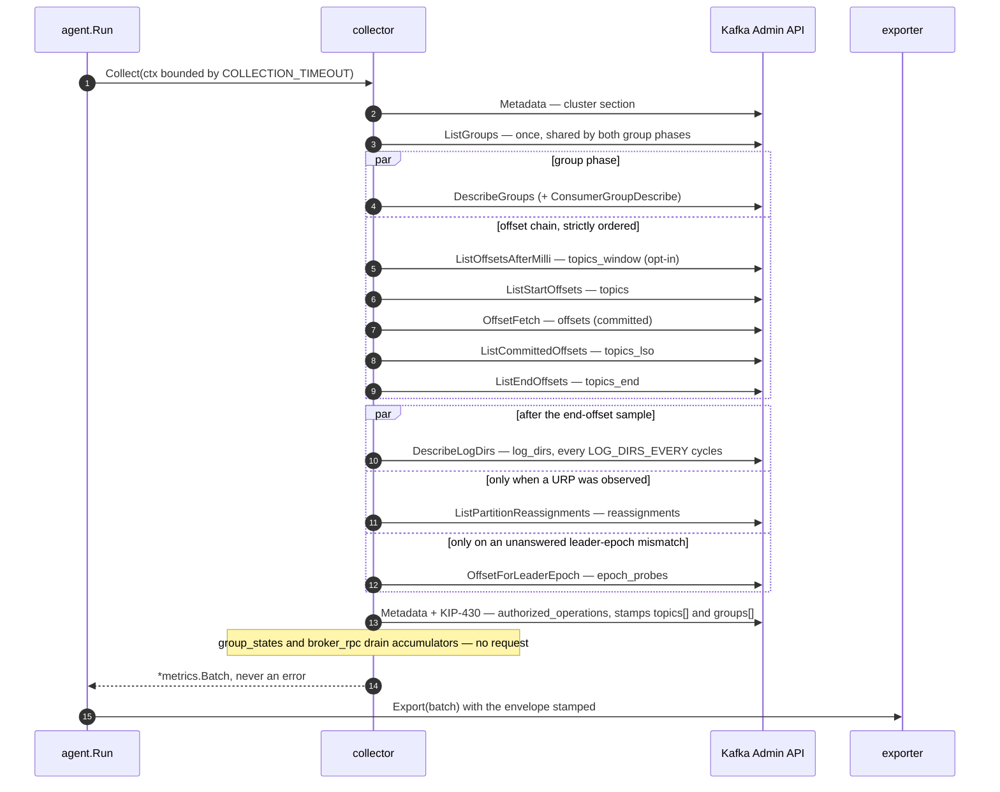

# Architecture

How one collection cycle is built. The two overview diagrams — the component pipeline and
the collection-phase ordering — are in [README.md](../README.md#how-it-works); this file is
the level below them.

## Packages

| Package | Role |
|---|---|
| `cmd/agent` | `main` → `run() error`, single `os.Exit`, `-version` flag, version via ldflags |
| `cmd/mock-ingest` | test-only binary; ships in no release artifact |
| `internal/config` | env-only loader; validates everything at startup and reports **all** problems at once. `Warnings()` covers legal-but-suspicious settings |
| `internal/agent` | lifecycle: ticker, per-cycle deadline, batch envelope, self-telemetry, graceful shutdown. Also owns the two startup decisions — `applyCapabilityGates` (which phases this cluster can serve) and the goroutine running the fast group-state watcher on the signal context |
| `internal/kafka` | one `kgo.Client` wrapped in `kadm.Client`; SASL PLAIN/SCRAM, TLS; retry and metadata-age tuning. `capabilities.go` = the cached ApiVersions fingerprint (per-key floors, always the **minimum** across brokers) and its wire shape; `hooks.go` = the `kgo` broker hooks that accumulate the RPC window; `client.go` also exposes `Request` / `RequestSharded`, the raw-kmsg escape hatch for the two protocol fields kadm drops |
| `internal/collector` | the phases, one file each. `errors.go` = section names and their wire order, section/error machinery, `limits.go` = caps, dedup keys and admission priority, `metadata.go` / `groups.go` / `offsets.go` / `logdirs.go` / `throughput.go` / `authops.go` / `reassign.go` / `truncation.go` / `dwell.go` / `rpc.go` = phases, `filter.go` = topic and group regex. `dwell.go` is the odd one: it owns a watcher with its own ticker that the agent runs, and its phase only drains it |
| `internal/metrics` | `types.go` — the wire contract |
| `internal/export` | `exporter.go` (interface + factory), `file.go`, `stdout.go`, `http.go` |
| `internal/mockingest` | conformance-checking mock ingest with deterministic fault injection |

## One cycle

Those arrows are not all alike, and the difference is what a capacity estimate turns on:

* `log_dirs`, `topics_window` and `authorized_operations` are **cadenced** — they run on
  every Nth cycle whenever their phase is enabled, whatever the cluster is doing.
* `reassignments` fires only when this batch's own `topics[]` contains an under-replicated
  partition, and `epoch_probes` only when a group's committed leader epoch disagrees with the
  partition's current one **and that exact question has not already been answered**. The
  suppression is not an optimisation: a committed epoch converges with the metadata epoch
  only when the group consumes a record produced under the new one, so after any rolling
  restart an idle partition mismatches for as long as its offsets are retained, and an
  unsuppressed trigger would fan out every cycle for days.
* Both triggered phases read the batch's own `topics[]`/`offsets[]` rather than raw metadata,
  so every row they emit has a join partner in the same batch — and a partition dropped by a
  cap is never asked about.

`log_dirs` has two request paths behind one arrow: raw kmsg `DescribeLogDirs` **v4** via
`Client.RequestSharded` when every broker serves it, `kadm.DescribeAllLogDirs` below that.
Same API key, same sharding, same ACL; the version only adds the KIP-827 volume figures that
kadm's decoder drops.

`Collect` never returns an error: a cycle that fails in part still ships the parts that
worked and reports the rest in `sections[]` and `errors[]`. Ordering is enforced by channel
closes between the phase goroutines, not by comments — see `collector.go`.

## Request budget per cycle

`L` = leader brokers, `B` = brokers. Phases are grouped by *what decides whether they issue
anything*, because that is what a capacity estimate turns on.

**Unconditional — every cycle, on by default**

| Phase | Requests |
|---|---|
| `cluster` | 1 `Metadata`, all topics |
| `topics` / `topics_lso` / `topics_end` | 2 or 3 × `ListOffsets` fanned out to leaders (`topics_lso` only with `COLLECT_LAST_STABLE_OFFSET`), each preceded by a `ListTopics` inside kadm |
| `groups` | `DescribeGroups` sharded by coordinator, one `ListGroups` broadcast shared with `offsets` |
| `offsets` | one batched `OffsetFetch` sharded by coordinator — O(brokers), not O(groups) |

**Cadenced — every Nth cycle when enabled**

| Phase | Requests |
|---|---|
| `authorized_operations` | 1 `Metadata` on the cycles it runs (`AUTHORIZED_OPS_EVERY`, default 10), O(partitions of the selected topics); the group bitfields ride the `DescribeGroups` above and cost nothing. **On by default** |
| `log_dirs` | 1 `DescribeLogDirs` sharded to all brokers on the cycles it runs (`LOG_DIRS_EVERY`, default 10). Off by default; the response is O(replicas), the largest payload the agent emits |
| `topics_window` | 1 `ListOffsets` fan-out on the cycles it runs (`THROUGHPUT_WINDOW_EVERY`, default 1), and a **second** for every partition that answered -1 — kadm re-lists those as end offsets, so a mostly-silent cluster pays twice. Off by default |

**Triggered — zero unless the cluster gives them a reason**

| Phase | Requests |
|---|---|
| `reassignments` | 1 request to the controller, only when a URP is in this batch's `topics[]`, at most 1000 partitions named. Normally zero. **On by default** |
| `epoch_probes` | 0 in steady state; up to 4 sharded `OffsetForLeaderEpoch` in the cycle after a leader election, then 0 again — the question is remembered, not re-asked. **On by default** |

**No request at all**

| Phase | Requests |
|---|---|
| `broker_rpc` | 0 — kgo hook counters detached and reset per cycle. Zero requests, but the largest *unmeasured* contributor to batch size: O(`B` × API keys issued), two 12-bucket histograms per API row. **On by default** |
| `group_states` | 0 **per cycle**, and the only phase whose cost is not paid per cycle: a SECOND ticker issuing 1 sharded `ListGroups` per `GROUP_STATE_POLL_INTERVAL`, i.e. `B` requests per tick, `6·B` per 30s interval at the defaults. Off by default |

At the defaults that is roughly `3·L + 3·B` requests per cycle, plus 1 `Metadata` on an
authorized-operations cycle. Six of the thirteen phases add nothing to a healthy cluster at
the defaults; `COLLECT_GROUP_STATES` is the only setting that adds requests *between* cycles,
and `COLLECT_RPC_STATS` is the only one that adds meaningful bytes without adding a request.
kadm asks for metadata several times per cycle but only the first reaches the wire:
`kgo.MetadataMinAge` is pinned to half the collection interval, so the reads within one cycle
share a single snapshot while every cycle still refetches once.

One `ApiVersions` per broker is issued at startup only. It is cached for the client's
lifetime, so the `GROUP_STATES` check, every optional phase's capability gate and the
`cluster.capabilities` fingerprint on the wire all come out of that one probe.

## Cadence and concurrency notes

* `ListGroups` runs once per cycle and its result feeds both `groups` and `offsets`, so the
  two sections can never disagree about which groups exist. `MAX_GROUPS` is enforced there
  and nowhere else, which is why it truncates both.
* `log_dirs`, `topics_window` and `authorized_operations` share one process-local 0-based
  cycle counter, so a fresh agent samples each on its first cycle rather than N intervals
  in. A crash-looping agent therefore samples every cycle; that is accepted, and visible at
  the backend as `agent_instance_id` churn.
* Section errors are merged, deduplicated and capped once, after all phases have joined, on
  a single goroutine — a shared budget would make the surviving set depend on scheduling.
* `broker_rpc` and `group_states` run **after** `wg.Wait()`, which is what makes the RPC
  window cover this cycle's own traffic rather than the previous cycle's. The RPC snapshot
  detaches and resets the window, so there must be **exactly one caller per cycle**: a second
  call would silently halve the first's numbers.
* Two accumulators outlive a cycle and are therefore process-local state to be aware of on a
  restart: the RPC window (reset every cycle, so a restart loses at most one), and the
  epoch-probe suppression set (`probedEpochs`, bounded at 8192 keys and cleared wholesale
  when full — a periodic clean slate rather than an LRU whose eviction order would decide
  which partitions get re-probed). A restart re-asks every suppressed question once.
* Capability gating happens once, at startup, from one cached `ApiVersions` probe per broker.
  Six phases can be switched off by it; only `GROUP_STATES` fails startup instead, because an
  unsupported state filter returns *more* than was asked for rather than less. A probe that
  failed leaves every phase as configured and logs loudly — a spurious disable would hide
  data a perfectly capable cluster can serve.
