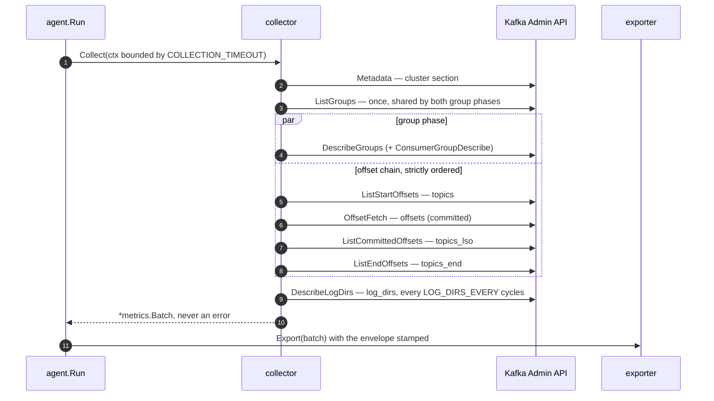

# Architecture

How one collection cycle is built. The two overview diagrams — the component pipeline and
the collection-phase ordering — are in [README.md](../README.md#how-it-works); this file is
the level below them.

## Packages

| Package | Role |
|---|---|
| `cmd/agent` | `main` → `run() error`, single `os.Exit`, `-version` flag, version via ldflags |
| `cmd/mock-ingest` | test-only binary; ships in no release artifact |
| `internal/config` | env-only loader; validates everything at startup and reports **all** problems at once. `Warnings()` covers legal-but-suspicious settings |
| `internal/agent` | lifecycle: ticker, per-cycle deadline, batch envelope, self-telemetry, graceful shutdown |
| `internal/kafka` | one `kgo.Client` wrapped in `kadm.Client`; SASL PLAIN/SCRAM, TLS; retry and metadata-age tuning; the startup ApiVersions probes |
| `internal/collector` | the seven phases. `errors.go` = section/error machinery, `limits.go` = caps, dedup keys and admission priority, `metadata.go` / `groups.go` / `offsets.go` / `logdirs.go` = phases, `filter.go` = topic and group regex |
| `internal/metrics` | `types.go` — the wire contract |
| `internal/export` | `exporter.go` (interface + factory), `file.go`, `stdout.go`, `http.go` |
| `internal/mockingest` | conformance-checking mock ingest with deterministic fault injection |

## One cycle

`Collect` never returns an error: a cycle that fails in part still ships the parts that
worked and reports the rest in `sections[]` and `errors[]`. Ordering is enforced by channel
closes between the phase goroutines, not by comments — see `collector.go`.

## Request budget per cycle

| Phase | Requests |
|---|---|
| `cluster` | 1 `Metadata`, all topics |
| `topics` / `topics_lso` / `topics_end` | 2 or 3 × `ListOffsets` fanned out to leaders (`topics_lso` only with `COLLECT_LAST_STABLE_OFFSET`), each preceded by a `ListTopics` inside kadm |
| `groups` | `DescribeGroups` sharded by coordinator |
| `offsets` | one batched `OffsetFetch` sharded by coordinator — O(brokers), not O(groups) |
| `log_dirs` | `DescribeLogDirs` sharded to all brokers, only on the cycles it runs |

At the defaults that is roughly `3·L + 3·B` requests, `L` = leader brokers, `B` = brokers,
plus `B` on a log-dirs cycle. kadm asks for metadata four times per cycle but only the first
reaches the wire: `kgo.MetadataMinAge` is pinned to half the collection interval, so the
reads within one cycle share a single snapshot while every cycle still refetches once.

One `ApiVersions` per broker is issued at startup only — when `GROUP_STATES` is set, and
when `COLLECT_CONSUMER_GROUPS` is on.

## Cadence and concurrency notes

* `ListGroups` runs once per cycle and its result feeds both `groups` and `offsets`, so the
  two sections can never disagree about which groups exist. `MAX_GROUPS` is enforced there
  and nowhere else, which is why it truncates both.
* `log_dirs` uses a process-local 0-based counter, so a fresh agent samples on its first
  cycle rather than `LOG_DIRS_EVERY` intervals in. A crash-looping agent therefore samples
  every cycle; that is accepted, and visible at the backend as `agent_instance_id` churn.
* Section errors are merged, deduplicated and capped once, after all phases have joined, on
  a single goroutine — a shared budget would make the surviving set depend on scheduling.
