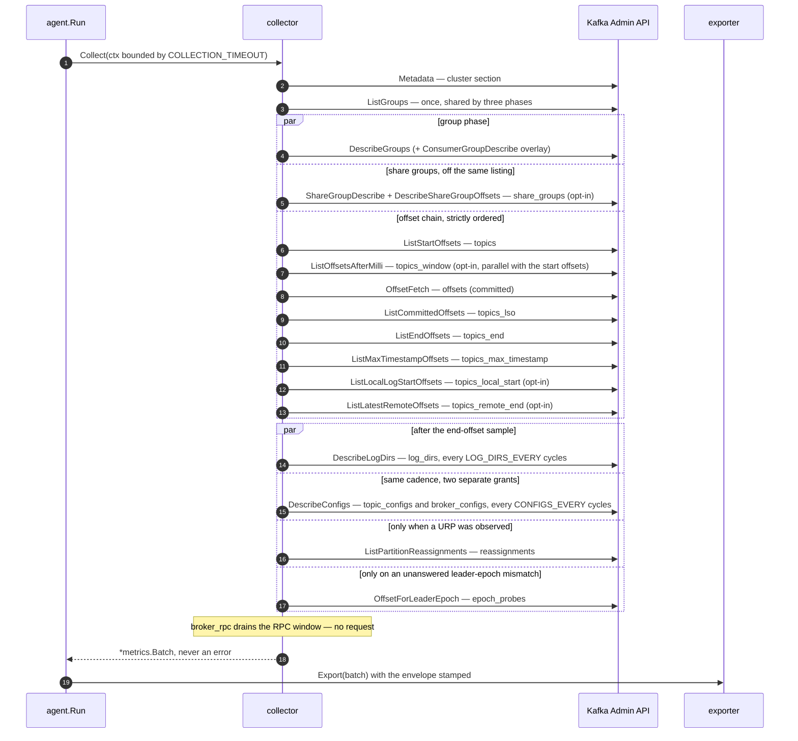

# Architecture

How one collection cycle is built. The two overview diagrams — the component pipeline and
the collection-phase ordering — are in [README.md](../README.md#how-it-works); this file is
the level below them.

## Packages

| Package | Role |
|---|---|
| `cmd/agent` | `main` → `run() error`, single `os.Exit`, `-version` flag, version via ldflags |
| `cmd/mock-ingest` | test-only binary; ships in no release artifact |
| `internal/config` | env-only loader; validates everything at startup and reports **all** problems at once. `Warnings()` covers legal-but-suspicious settings |
| `internal/agent` | lifecycle: ticker, per-cycle deadline, batch envelope, self-telemetry, graceful shutdown. Also owns the two startup decisions — `applyCapabilityGates`, which phases this cluster can serve, and `collectorOptions`, a named function rather than a literal so a test can prove every setting actually reaches the collector |
| `internal/kafka` | one `kgo.Client` wrapped in `kadm.Client`; SASL PLAIN/SCRAM, TLS; retry and metadata-age tuning. `capabilities.go` = the cached ApiVersions fingerprint (per-key floors, always the **minimum** across brokers) and its wire shape; `hooks.go` = the `kgo` broker hooks that accumulate the RPC window; `client.go` also exposes `Request` / `RequestSharded`, the raw-kmsg escape hatch for the protocol fields kadm decodes and then drops — `ListGroups` v5's `GroupType` and `DescribeLogDirs` v4's `TotalBytes`/`UsableBytes` |
| `internal/collector` | the phases. `errors.go` = section names and their wire order, section/error machinery, `limits.go` = caps, dedup keys and admission priority, `filter.go` = the topic and group name filters, and the entry convention they compile (a literal unless slash-wrapped). `metadata.go` / `groups.go` / `offsets.go` / `logdirs.go` / `throughput.go` / `configs.go` / `sharegroups.go` / `reassign.go` / `truncation.go` / `rpc.go` = phases. Two of those files are not one phase each: `metadata.go` owns `cluster` **and** the whole six-section offset chain, because the chain is one ordered sequence and splitting it would put the ordering constraint across a file boundary; `configs.go` owns two, because `DESCRIBE_CONFIGS` is granted separately on `TOPIC` and on `CLUSTER` and a principal holding one and not the other has to see one section `ok` and the other `unauthorized` |
| `internal/metrics` | `types.go` — the wire contract |
| `internal/export` | `exporter.go` (interface + factory), `file.go`, `stdout.go`, `http.go` |
| `internal/mockingest` | conformance-checking mock ingest with deterministic fault injection |

## One cycle



The three flavours after `topics_end` are deliberately outside the
`start ≤ committed ≤ LSO ≤ end` chain and must stay after it. They are the same `ListOffsets`
API key under a different timestamp sentinel, so they need no permission the chain did not
already need — but each costs a round trip, and issuing any of them earlier would inflate the
very sample latency `topics_end` exists to pin down.

### The wire order

`sections[]` is emitted in **sample order**, and it is the same seventeen names on every
cycle — a phase that did not run this cycle still ships its section, marked `skipped`, so
that "not collected" and "collected, nothing there" can never be the same batch. A backend
may treat all seventeen as required and assert their relative order:

```
cluster
topics  topics_window  topics_lso  topics_end
topics_max_timestamp  topics_local_start  topics_remote_end
groups  offsets
epoch_probes
log_dirs  reassignments  topic_configs  broker_configs  share_groups
broker_rpc
```

That list is `internal/collector/errors.go`'s constant block, exported as
`collector.SectionNames()`, asserted against `canonicalSections` in `collector_test.go` and
— since the ingest side had no binding to it and drifted once because of that — asserted
again in `internal/mockingest/sections_test.go`, which requires `mockingest.DefaultSections`
to equal it element for element, order included. There is no `authorized_operations` and no
`group_states`: both sections were removed, and a required-section list carrying either would
reject every batch this agent sends.

`group_states` is worth naming once, because two unrelated things were spelled almost the
same. The deleted one was a **section**: a second ticker polling `ListGroups` between cycles
to time how long a group dwelt in each state. It came back non-functional against a real
rebalance storm — 33 batches, 31 genuine member-set changes, two transitions observed and
`Stable` on every sample — so rebalance detection now comes from member-set churn in
`groups[].members[].member_id`, which already ships every batch at no extra request. What
survives, and is not going anywhere, is `GROUP_STATES`: the broker-side **filter** passed to
`ListGroups` as `StatesFilter`, a cardinality control that keeps filtered groups off the wire
entirely. Different mechanism, different direction, same six letters.

Those arrows are not all alike, and the difference is what a capacity estimate turns on:

* `log_dirs`, `topics_window`, `topic_configs` and `broker_configs` are **cadenced** — they
  run on every Nth cycle whenever their phase is enabled, whatever the cluster is doing. The
  two config sections share one cadence, one API key and one request shape, but not one ACL,
  which is the whole reason they are two sections.
* `reassignments` fires only when this batch's own `topics[]` contains an under-replicated
  partition, and `epoch_probes` only when a group's committed leader epoch disagrees with the
  partition's current one **and that exact question has not already been answered by a
  leader**. The suppression is not an optimisation: a committed epoch converges with the
  metadata epoch only when the group consumes a record produced under the new one, so after
  any rolling restart an idle partition mismatches for as long as its offsets are retained,
  and an unsuppressed trigger would fan out every cycle for days. Only a leader that answered
  *that* partition without an error retires the question — a failed request, an omitted
  partition or an error code all leave it open, because those three are exactly what a leader
  election in flight produces.
* Both triggered phases read the batch's own `topics[]`/`offsets[]` rather than raw metadata,
  so every row they emit has a join partner in the same batch — and a partition dropped by a
  cap is never asked about.

`log_dirs` has two request paths behind one arrow: raw kmsg `DescribeLogDirs` **v4** via
`Client.RequestSharded` when every broker serves it, `kadm.DescribeAllLogDirs` below that.
Same API key, same sharding, same ACL; the version only adds the KIP-827 volume figures that
kadm's decoder drops.

`Collect` never returns an error: a cycle that fails in part still ships the parts that
worked and reports the rest in `sections[]` and `errors[]`. Ordering is enforced by channel
closes between the phase goroutines, not by comments — see `collector.go`.

## Request budget per cycle

`L` = leader brokers, `B` = brokers. Phases are grouped by *what decides whether they issue
anything*, because that is what a capacity estimate turns on. Cadences are quoted in cycles
and in wall-clock at the default `COLLECTION_INTERVAL` of **5s**.

**Unconditional — every cycle, on by default**

| Phase | Requests |
|---|---|
| `cluster` | 1 `Metadata`, all topics |
| `topics` / `topics_lso` / `topics_end` / `topics_max_timestamp` | **4** × `ListOffsets` fanned out to leaders at the defaults — start (`-2`), committed (`-1` at `READ_COMMITTED`, `COLLECT_LAST_STABLE_OFFSET`, on), end (`-1`), max-timestamp (`-3`, `COLLECT_MAX_TIMESTAMP`, on, **every `MAX_TIMESTAMP_EVERY`=12 cycles**) — each preceded by a `ListTopics` inside kadm. 2 with both of those turned off. Every flavour is the same API key with a different timestamp sentinel, so none of them adds an ACL |
| `groups` | `DescribeGroups` sharded by coordinator, one `ListGroups` broadcast shared with `offsets` and `share_groups`, and — on Kafka 4.0+ with `COLLECT_CONSUMER_GROUPS` (on by default) — a second coordinator-sharded `ConsumerGroupDescribe` overlay. Below 4.0 the capability gate removes that one at startup, so it is never a per-cycle cost on a cluster that cannot serve it |
| `offsets` | one batched `OffsetFetch` sharded by coordinator — O(brokers), not O(groups) |

**Cadenced — every Nth cycle when enabled**

| Phase | Requests |
|---|---|
| `log_dirs` | 1 `DescribeLogDirs` sharded to all brokers on the cycles it runs (`LOG_DIRS_EVERY`, default 24 — once every two minutes at 5s). **On by default**; the response is O(replicas) and the largest payload the agent emits, which is what the cadence is for rather than a reason to leave per-replica disk uncollected |
| `topic_configs` | 1 `DescribeConfigs` naming every selected topic on the cycles it runs (`CONFIGS_EVERY`, default 360 — once every thirty minutes at 5s), projected onto a fixed 10-key allowlist. kgo sends every topic resource to one broker, so this is one request however many topics there are. **On by default**, and the only phase needing a grant outside the three `DESCRIBE`s: `DESCRIBE_CONFIGS` on `TOPIC` |
| `broker_configs` | 1 `DescribeConfigs` per broker on the same cycles — kgo shards broker resources to their own broker, so `B` requests — projected onto an 11-key allowlist. `DESCRIBE_CONFIGS` on `CLUSTER`. **On by default** |
| `topics_window` | 1 `ListOffsets` fan-out on the cycles it runs (`THROUGHPUT_WINDOW_EVERY`, default 1 — every cycle), and a **second** for every partition that answered -1: kadm re-lists those as end offsets, so a mostly-silent cluster pays twice. Off by default |

That re-list is not the window's alone. kadm re-requests any partition that answered `-1`
with no error whenever the sentinel it asked with was not `-1`
(`kadm@v1.18.0/metadata.go:498-582`), which covers `-3` and both tiered sentinels as well as
a millisecond. An empty partition answers `-1` to `ListMaxTimestampOffsets`, and a topic with
no remote data answers `-1` to both tiered sentinels, so each of those fan-outs can cost two
round trips instead of one on a sparse cluster — `topics_max_timestamp` included, and it is
on by default. `ListEndOffsets` is structurally exempt because it asks with `-1` itself;
`ListStartOffsets` is eligible but a broker asked for the earliest offset answers `0`, not
`-1`, so it does not fire in practice.

**Triggered — zero unless the cluster gives them a reason**

| Phase | Requests |
|---|---|
| `reassignments` | 1 request to the controller, only when a URP is in this batch's `topics[]`, at most 1000 partitions named. Normally zero. **Always on** |
| `epoch_probes` | 0 in steady state; up to 4 sharded `OffsetForLeaderEpoch` in the cycle after a leader election, then 0 again — the question is remembered once a leader answers it, not re-asked. **Always on** |

**Opt-in — zero unless switched on**

| Phase | Requests |
|---|---|
| `topics_local_start` / `topics_remote_end` | 0 at the defaults; 1 or 2 further `ListOffsets` fan-outs with `COLLECT_TIERED_OFFSETS`, the second dropped by the startup capability probe — not by a second setting — because KIP-1005 landed five releases after KIP-405 and a 3.4–3.8 cluster serves `-4` but not `-5`. Both carry the re-list above |
| `share_groups` | 0 at the defaults; with `COLLECT_SHARE_GROUPS` on a 4.0+ cluster, **2** coordinator-sharded requests — `ShareGroupDescribe` and `DescribeShareGroupOffsets` — and only for the groups the shared `ListGroups` already reported with `GroupType: share`, so a cluster with no share groups pays nothing but the listing it was making anyway |

**No request at all**

| Phase | Requests |
|---|---|
| `broker_rpc` | 0 — kgo hook counters detached and reset per cycle. Zero requests, but the largest *unmeasured* contributor to batch size: O(`B` × API keys issued), two 12-bucket histograms per API row. **Always on** |

At the defaults that is roughly `4·L + 3·B` requests per cycle, plus 1 `Metadata` for the
`cluster` section, `B` more on a log-dirs cycle and `1 + B` more on a configs cycle. The four
`L` fan-outs are all `ListOffsets` under a different timestamp sentinel —
`ListStartOffsets`, `ListCommittedOffsets`, `ListEndOffsets`, `ListMaxTimestampOffsets`, all
in `metadata.go` — call it `5·L` on a cluster with idle partitions, where the max-timestamp
fan-out pays kadm's re-list. The three `B` terms are the shared `ListGroups` broadcast,
`DescribeGroups` and `OffsetFetch`; the latter two shard by coordinator, so `B` is their
ceiling rather than their cost. On Kafka 4.0+ the `ConsumerGroupDescribe` overlay adds a
fourth.

Seven of the seventeen sections add nothing to a healthy cluster at the defaults: four are
opt-in and off (`topics_window`, `topics_local_start`, `topics_remote_end`, `share_groups`),
two are triggered and silent (`reassignments`, `epoch_probes`), and one drains an accumulator
(`broker_rpc`). All seven still ship a section every cycle. The last three carry no setting
at all — nothing to trade, so nothing to configure — and `broker_rpc` is the only phase that
adds meaningful bytes without adding a request; nothing the agent does issues a request
*between* cycles.

kadm asks for metadata five times in a default cycle — once for the `cluster` section and
once inside each of the four `List*Offsets`, which each begin with a `ListTopics` — and only
the first reaches the wire **for as long as the cycle is shorter than `kgo.MetadataMinAge`**.
`NewClient` pins that to half the collection interval (`kafka/client.go:76`, `:125-136`,
clamped to kgo's own 10ms floor and 5s ceiling), which is 2.5s at the defaults, against a
`COLLECTION_TIMEOUT` derived as 80% of the interval — 4s. So the guarantee holds for a cycle
under 2.5s and not above it: a slower cycle refetches part-way through, and its later offset
listings are then resolved against a topic set the `cluster` section never shipped. The
half-interval is deliberate in the other direction too — at or above kgo's 5s default a cycle
would issue no `Metadata` at all and ship a stale inventory under a fresh `sampled_at`. The
only lever on any of this is `COLLECTION_INTERVAL`.

One `ApiVersions` per broker is issued at startup only. It is cached for the client's
lifetime, so the `GROUP_STATES` check, every optional phase's capability gate and the
`cluster.capabilities` fingerprint on the wire all come out of that one probe.

## Cadence and concurrency notes

* `Collect` runs twelve goroutines against five channels — `metaDone`, `groupsListed`,
  `windowDone`, `committedDone`, `endDone`. Eleven are in the `WaitGroup`; the twelfth is the
  `ListGroups` publisher, which signals by closing `groupsListed` rather than by `wg.Done`.
* `ListGroups` runs once per cycle and its result feeds `groups`, `offsets` and
  `share_groups`, so those sections can never disagree about which groups exist. The
  `GROUP_INCLUDE`/`GROUP_EXCLUDE` filter is applied there and nowhere else, which
  is why it narrows all of them together. `share_groups` reads the raw response for its
  `GroupType` filter — the same broadcast, not a second one.
* `log_dirs`, `topics_window`, `topic_configs` and `broker_configs` share one process-local
  0-based cycle counter (`collector.go:282-289`), so a fresh agent samples each on its first
  cycle rather than N intervals in. A crash-looping agent therefore samples every cycle; that
  is accepted, and visible at the backend as `agent_instance_id` churn. The two config
  sections read one flag, `runCfg`, so they are always sampled together — a principal holding
  one grant and not the other sees the split, not a cadence skew.
* Section errors are merged, deduplicated and capped once, after all phases have joined, on
  a single goroutine — a shared budget would make the surviving set depend on scheduling.
* `broker_rpc` runs **after** `wg.Wait()`, which is what makes the RPC window cover this
  cycle's own traffic rather than the previous cycle's. The RPC snapshot detaches and resets
  the window, so there must be **exactly one caller per cycle**: a second call would silently
  halve the first's numbers.
* Two accumulators outlive a cycle and are therefore process-local state to be aware of on a
  restart: the RPC window (reset every cycle, so a restart loses at most one), and the
  epoch-probe suppression set (`probedEpochs`, bounded at 8192 keys and cleared wholesale
  when full — a periodic clean slate rather than an LRU whose eviction order would decide
  which partitions get re-probed). A restart re-asks every suppressed question once.
* Capability gating happens once, at startup, from one cached `ApiVersions` probe per broker.
  Ten phases can be switched off by it — `agent.applyCapabilityGates` names them, and the log
  line for each says what the broker would have answered instead. Only `GROUP_STATES` fails
  startup rather than being disabled, because an unsupported state filter is dropped on
  downgrade and the broker returns *more* than was asked for: an operator who set it to cut a
  40k-group listing down to a few hundred gets all 40k back, with no error. A probe that
  failed leaves every phase as configured and logs loudly — a spurious disable would hide
  data a perfectly capable cluster can serve.
